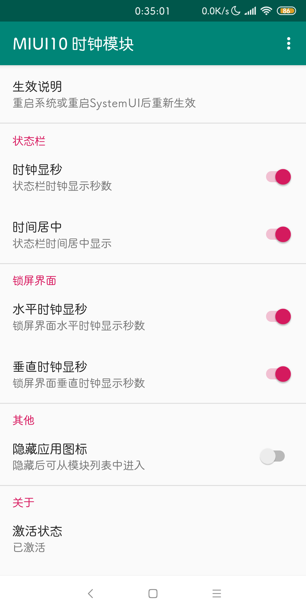

# XMiTools
MIUI 10 系统界面模块

[English README](/README-EN.md)
# 效果截图

# 下载
可在以下地方下载：
- [releases](/releases)
- [酷安](https://www.coolapk.com/apk/com.tianma.tweaks.miui)
- [Xposed仓库](https://repo.xposed.info/module/com.tianma.tweaks.miui)

# 注意
- 仅适用于MIUI 10，其他版本的 MIUI 系统以及非 MIUI 系统，请慎用。
- 支持 Xposed，EdXposed 和 太极阳。

# 功能
- 状态栏
  1. 状态栏显示秒数
  2. 状态栏时间对齐方式（居左，居中，居右）
  3. 自定义时间格式
  4. 自定义时间颜色
  5. 信号居左
  6. 信号双层显示
  7. 自定义显示的移动网络类型
- 下拉状态栏
  1. 时间显示秒数
  2. 自定义时间，日期颜色
  3. 显示天气信息
- 锁屏界面
  1. 水平时钟显示秒数
  2. 垂直时钟显示秒数

# 感谢
 - [custoMIUIzer](https://code.highspec.ru/Mikanoshi/CustoMIUIzer/)
 - [GravityBox](https://github.com/GravityBox/GravityBox)
 - [Xposed](https://github.com/rovo89/Xposed)
 - [Material Dialogs](https://github.com/afollestad/material-dialogs)
 - [Android Shell](https://github.com/jaredrummler/AndroidShell)

# 协议
本源码遵循 [GPLv3](https://www.gnu.org/licenses/gpl-3.0.txt) 协议
